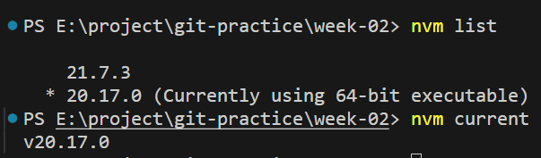
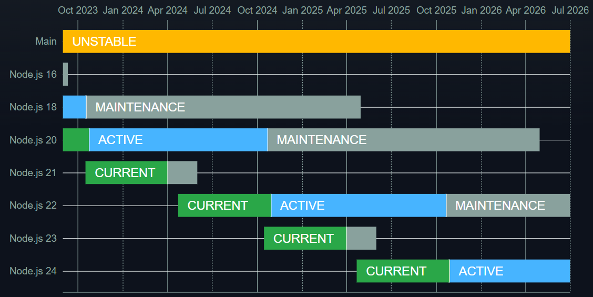

## week 02 - NodeJs
### Content
  1. 安裝的 nodejs 版本?
     - v20.17.0
       
     - `v20.17.0`：版本號20為偶數，並且已是 LTS version
       奇數版本號：測試版
       偶數版本號：將會或已升至 Long-Term Support (LTS) Version

     - Release Schedule
       <figure class="image">
       
       <figcaption>
       <a href="https://nodejs.org/en/about/previous-releases">https://nodejs.org/en/about/previous-releases</a>
       </figcaption>
       </figure>
     - 這是 NodeJs 官方的 Release Schedule，`v20.17.0` 是目前最新的LTS版本
     - 選用 `v20.17.0` 的原因：
       - 雖然`v22.9.0`(最新的偶數版本)已經可以在<a href="https://nodejs.org/en/download/package-manager">官方網站</a>下載，但目前未成為LTS版。
       - `v20.17.0`目前已成為LTS版，經過了current版期間的測試，大部分的潛在不穩定性已被完善，適用於廣泛使用。

1. (optional) 如果不是安裝 NodeJS，那可以試著說明為什麼？ → 練習回答技術選型問題
    - 使用NodeJS原因，目前NodeJs是最廣泛使用的
    - (在看過 Deno 的介紹後，對 Deno 感興趣，但由於我目前對 NodeJS 的功能我尚未完全熟悉，想和組員討論後再選擇是否跳槽 Deno )
2. nvm 與 npm 分別是什麼
    - nvm. (Node Version Manager)
      - nvm 是用來管理不同的 nodeJS 版本
      - nodeJS 版本迭代快速，經常不同專案需要切換不同的NodeJs 版本，因此 nvm 這類版本管理系統十分重要
    - nvm usage:
      - `nvm current`: 確認當前 nodeJs 版本
      - `nvm list`: 查看所有已存在的 nodeJs 版本
      - `nvm use [-version]`: 來切換不同的 nodeJS 版本
      - 如果切換 nodeJS 版本`[-version]`時，沒有 npm 時
        先 `nvm uninstall [-version]` 
        後`nvm install [-version] --with-npm`

    - npm. (Node Package Manager)
      - npm 是用來管理專案所用到的套件(packages)
      - 先 `npm init` 建立一個npm專案 產生`package.json`檔用來記錄下載了哪些檔案，和套件版本
      - 安裝後的檔案安裝在`node modules`中
      - 透過`package.json`在合作時，
        不必將套件安裝資料夾(node modules)分享出去，
        只需要分享紀錄檔`package.json`，再下載對應套件就行了。
      - 類似 python 的 pip(套件管理工具) 跟 requirement.txt(記錄檔) 
    - npm usage:
      - `npm init` 建立檔案所需的 `package.json`
      - `npm -v` 查閱 npm 的版本
      - `npm install [package name]` 下載所需套件
      - `npm run dev`  
### 小故事
 - NodeJs 是 Ryan Dahl 開發的，npm 是 Isaac Z. Schlueter
 - Isaac Z. Schlueter 是第一批 NodeJs Contributors，並在Ryan Dahl 離開 NodeJs 開發 Deno 後，接手 NodeJs 的 Project Leader
 (以上擷取自 Isaac Z. Schlueter 的 Resume https://izs.me/resume)

### 實驗紀錄
> 當執行 10000 次 recursive 時，
> raise RangeError: Maximum call stack size exceeded
> 因此沒有使用 recursive 進行測試

|         | 實驗一      | 實驗二         | 實驗三         |
| ------- | ----------- | -------------- | -------------- |
| warmup  | sum 5 item  | sum 10000 item | sum 100000item |
| map     | 0.050444 ms | 0.050111 ms    | 0.059683 ms    |
| reduce  | 0.040643 ms | 0.041498 ms    | 0.042708 ms    |
| forloop | 0.009195 ms | 0.008619       | 0.008879       |

Note:   當喚醒CPU 的時間適量時，實驗函式所需時間減少
        當喚醒CPU 的時間太長時，實驗函式時間反而增加

###  Reference: 
- NodeJS Version Release:
    https://nodejs.org/en/about/previous-releases
- 