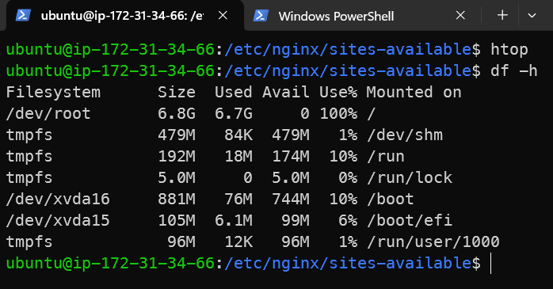
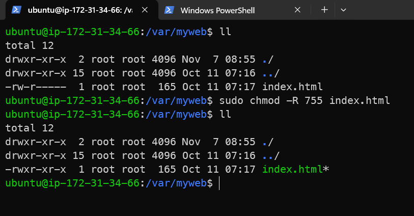
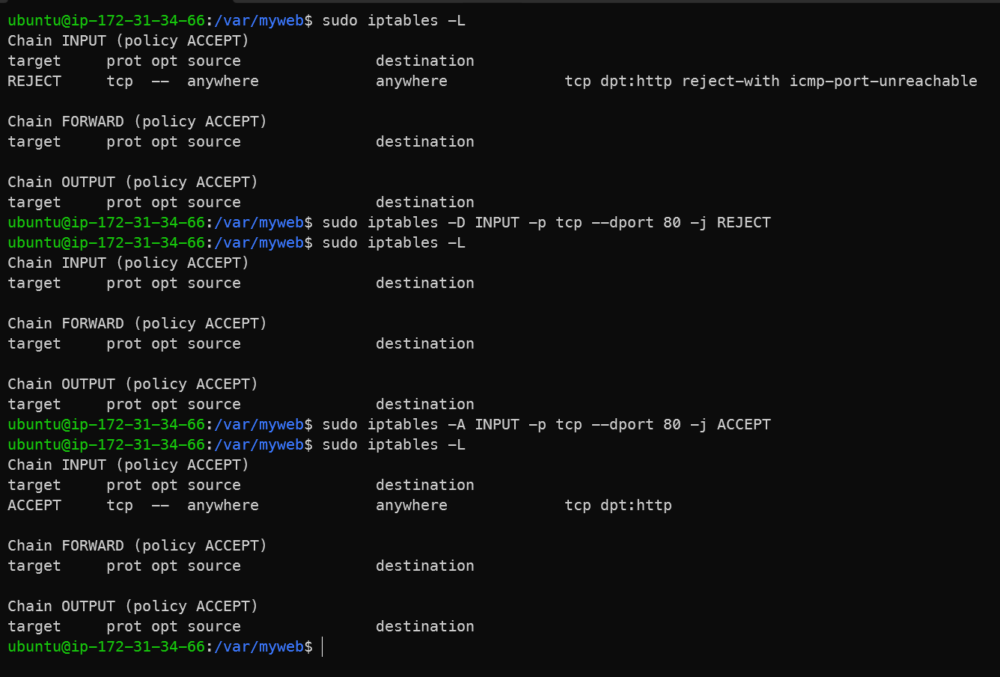
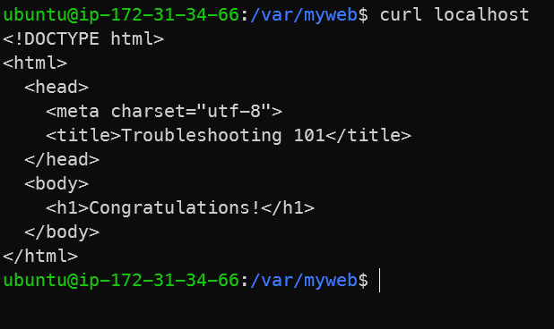
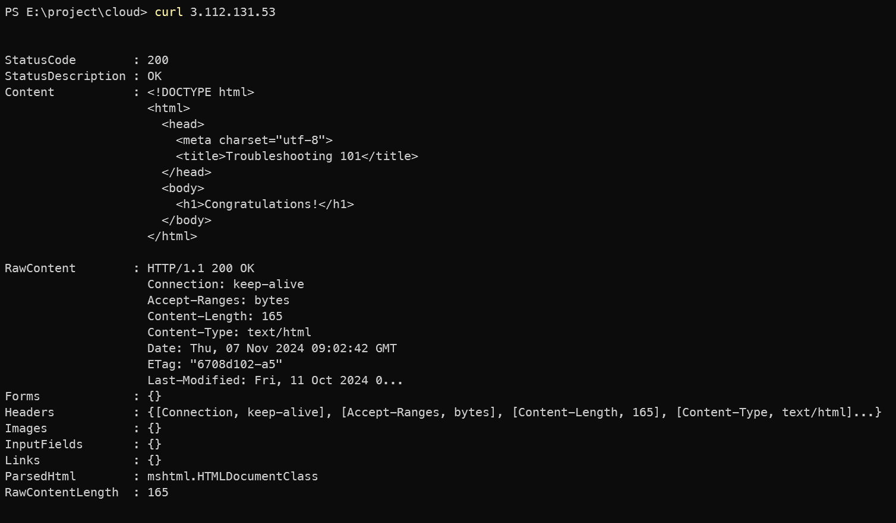
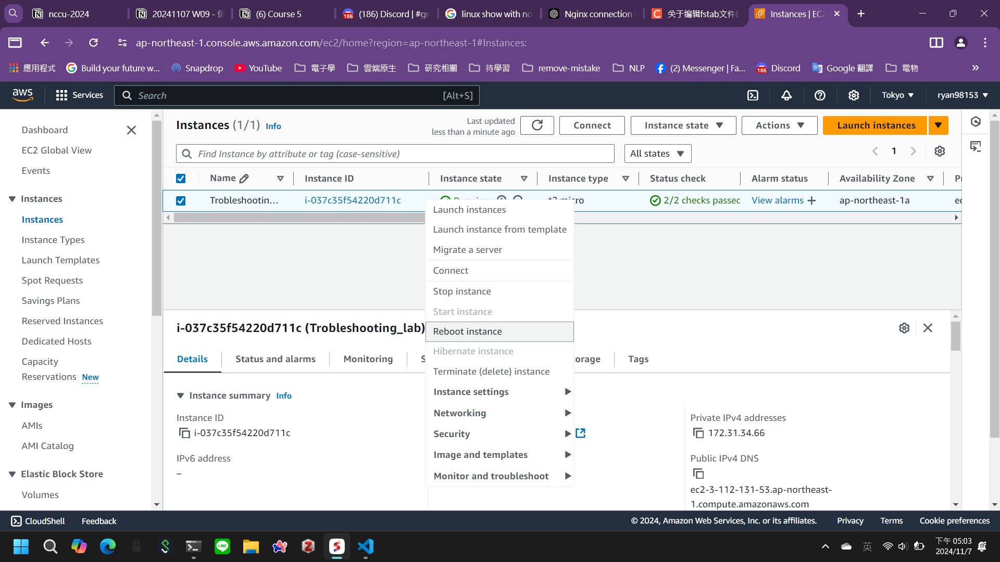

- sudo systemctl start nginx

``` sh
Job for nginx.service failed because the control process exited with error code.
See "systemctl status nginx.service" and "journalctl -xeu nginx.service" for details.
```

- systemctl status nginx.service
```sh
× nginx.service - A high performance web server and a reverse proxy server
     Loaded: loaded (/usr/lib/systemd/system/nginx.service; disabled; preset: enabled)
     Active: failed (Result: exit-code) since Thu 2024-11-07 07:14:32 UTC; 17s ago
       Docs: man:nginx(8)
    Process: 1390 ExecStartPre=/usr/sbin/nginx -t -q -g daemon on; master_process on; (code=exited, status=1/FAILURE)
        CPU: 4ms

Nov 07 07:14:32 ip-172-31-34-66 systemd[1]: Starting nginx.service - A high performance web server and a reverse proxy server...
Nov 07 07:14:32 ip-172-31-34-66 nginx[1390]: 2024/11/07 07:14:32 [emerg] 1390#1390: unexpected ";" in /etc/nginx/nginx.conf:8
Nov 07 07:14:32 ip-172-31-34-66 nginx[1390]: nginx: configuration file /etc/nginx/nginx.conf test failed
Nov 07 07:14:32 ip-172-31-34-66 systemd[1]: nginx.service: Control process exited, code=exited, status=1/FAILURE
Nov 07 07:14:32 ip-172-31-34-66 systemd[1]: nginx.service: Failed with result 'exit-code'.
Nov 07 07:14:32 ip-172-31-34-66 systemd[1]: Failed to start nginx.service - A high performance web server and a reverse proxy server.
```

- sudo head /etc/nginx/nginx.conf
``` sh
user www-data;
worker_processes auto;
pid /run/nginx.pid;
error_log /var/log/nginx/error.log;
include /etc/nginx/modules-enabled/*.conf;

events {
        worker_connections 768;;
        # multi_accept on;
}
ubuntu@ip-172-31-34-66:~$
```

- sudo vim /etc/nginx/nginx.conf
-- remove line 8 extra "；"

- journalctl -xeu nginx.service
```sh
Nov 07 07:31:34 ip-172-31-34-66 systemd[1]: Starting nginx.service - A high performance web server and a reverse proxy server...
░░ Subject: A start job for unit nginx.service has begun execution
░░ Defined-By: systemd
░░ Support: http://www.ubuntu.com/support
░░
░░ A start job for unit nginx.service has begun execution.
░░
░░ The job identifier is 3762.
Nov 07 07:31:34 ip-172-31-34-66 nginx[1704]: nginx: [emerg] bind() to 0.0.0.0:80 failed (98: Address already in use)
Nov 07 07:31:35 ip-172-31-34-66 nginx[1704]: nginx: [emerg] bind() to 0.0.0.0:80 failed (98: Address already in use)
Nov 07 07:31:35 ip-172-31-34-66 nginx[1704]: nginx: [emerg] bind() to 0.0.0.0:80 failed (98: Address already in use)
Nov 07 07:31:36 ip-172-31-34-66 nginx[1704]: nginx: [emerg] bind() to 0.0.0.0:80 failed (98: Address already in use)
Nov 07 07:31:36 ip-172-31-34-66 nginx[1704]: nginx: [emerg] bind() to 0.0.0.0:80 failed (98: Address already in use)
Nov 07 07:31:37 ip-172-31-34-66 systemd[1]: nginx.service: Control process exited, code=exited, status=1/FAILURE
░░ Subject: Unit process exited
░░ Defined-By: systemd
░░ Support: http://www.ubuntu.com/support
░░
░░ An ExecStart= process belonging to unit nginx.service has exited.
░░
░░ The process' exit code is 'exited' and its exit status is 1.
Nov 07 07:31:37 ip-172-31-34-66 nginx[1704]: nginx: [emerg] still could not bind()
Nov 07 07:31:37 ip-172-31-34-66 systemd[1]: nginx.service: Failed with result 'exit-code'.
░░ Subject: Unit failed
░░ Defined-By: systemd
░░ Support: http://www.ubuntu.com/support
░░
░░ The unit nginx.service has entered the 'failed' state with result 'exit-code'.
Nov 07 07:31:37 ip-172-31-34-66 systemd[1]: Failed to start nginx.service - A high performance web server and a reverse proxy server.
░░ Subject: A start job for unit nginx.service has failed
░░ Defined-By: systemd
░░ Support: http://www.ubuntu.com/support
```

- GPT 搜尋 journalctl -xeu nginx.service 的結果

- 找 80 port
- sudo lsof -i :80
```sh
ubuntu@ip-172-31-34-66:~$ sudo lsof -i :80
COMMAND PID USER   FD   TYPE DEVICE SIZE/OFF NODE NAME
srv     577 root    3u  IPv6   6605      0t0  TCP *:http (LISTEN)
```

- 檢查 nginx
```sh
ubuntu@ip-172-31-34-66:~$ sudo systemctl start nginx
ubuntu@ip-172-31-34-66:~$ sudo systemctl status nginx
● nginx.service - A high performance web server and a reverse proxy server
     Loaded: loaded (/usr/lib/systemd/system/nginx.service; disabled; preset: enabled)
     Active: active (running) since Thu 2024-11-07 07:41:08 UTC; 7s ago
       Docs: man:nginx(8)
    Process: 1785 ExecStartPre=/usr/sbin/nginx -t -q -g daemon on; master_process on; (code=exited, status=0/SUCCESS)
    Process: 1787 ExecStart=/usr/sbin/nginx -g daemon on; master_process on; (code=exited, status=0/SUCCESS)
   Main PID: 1788 (nginx)
      Tasks: 2 (limit: 1130)
     Memory: 1.7M (peak: 1.7M)
        CPU: 10ms
     CGroup: /system.slice/nginx.service
             ├─1788 "nginx: master process /usr/sbin/nginx -g daemon on; master_process on;"
             └─1789 "nginx: worker process"

Nov 07 07:41:08 ip-172-31-34-66 systemd[1]: Starting nginx.service - A high performance web server and a reverse proxy server...
Nov 07 07:41:08 ip-172-31-34-66 systemd[1]: Started nginx.service - A high performance web server and a reverse proxy server.
```

- Nginx has started successfully
- 檢查 curl

```sh
ubuntu@ip-172-31-34-66:~$ curl localhost
curl: (7) Failed to connect to localhost port 80 after 0 ms: Couldn't connect to server
ubuntu@ip-172-31-34-66:~$ sudo lsof -i :80
COMMAND  PID     USER   FD   TYPE DEVICE SIZE/OFF NODE NAME
nginx   1788     root    6u  IPv4  15250      0t0  TCP *:http (LISTEN)
nginx   1789 www-data    6u  IPv4  15250      0t0  TCP *:http (LISTEN)
ubuntu@ip-172-31-34-66:~$
```

- copy default
```sh
ubuntu@ip-172-31-34-66:/etc/nginx/sites-available$ sudo cp default default2
cp: error copying 'default' to 'default2': No space left on device
```

- htop


- check disk space
```sh
df -h
```


- 搜尋 GPT
```md
- Your root filesystem (/dev/root) is indeed full, which is why you're seeing the "No space left on device" error. Here are some steps you can take to free up space on your root filesystem:

Identify Large Files: Find large files on your root filesystem to identify possible candidates for deletion:
```

```bash
sudo find / -type f -size +50M -exec ls -lh {} \; | sort -k 5 -h
This command lists files larger than 50 MB, which you can review and consider deleting if they're unnecessary.
```

- sudo systemctl status

Remove Unnecessary Logs: Check the /var/log directory, as logs often consume a lot of space. You can delete or truncate large log files:

```bash
sudo rm -f /var/log/*.log
sudo journalctl --vacuum-size=100M  # Reduce systemd journal logs to 100 MB
```

- 查詢大檔案
```bash
du: cannot access '/proc/3287/task/3287/fd/4': No such file or directory
du: cannot access '/proc/3287/task/3287/fdinfo/4': No such file or directory
du: cannot access '/proc/3287/fd/3': No such file or directory
du: cannot access '/proc/3287/fdinfo/3': No such file or directory
7.1G    /
5.1G    /var
4.0G    /var/log/system
4.0G    /var/log
1.5G    /usr
1.2G    /var/lib
1.1G    /var/log/system/largefile3
1.1G    /var/log/system/largefile2
1.1G    /var/log/system/largefile1
977M    /var/log/system/largefile4
863M    /var/lib/containers/storage
863M    /var/lib/containers
860M    /var/lib/containers/storage/overlay
840M    /usr/lib
396M    /snap
268M    /usr/share
256M    /var/lib/containers/storage/overlay/6c4b10a55e597d34bf307ea56c5f1f6015d509b0ac9d46df93bf3452b6a7b521/diff
256M    /var/lib/containers/storage/overlay/6c4b10a55e597d34bf307ea56c5f1f6015d509b0ac9d46df93bf3452b6a7b521
253M    /var/lib/containers/storage/overlay/6c4b10a55e597d34bf307ea56c5f1f6015d509b0ac9d46df93bf3452b6a7b521/diff/usr
244M    /var/lib/containers/storage/overlay/40ce6fc40c6c369bc098a9c9e983d71ea04f8f3f7f43e089f1e449ee6826a748/diff/usr/local/go
```

- 找到 largefile
``` sh
ubuntu@ip-172-31-34-66:/etc/nginx/sites-available$ ls /var/log/system
largefile1  largefile2  largefile3  largefile4
```

- 80
``` 
server {
    listen 80 default_server;
    listen [::]:80 default_server;

    server_name _;

    location / {
        root /var/www/html;
        index index.html;
    }
}
```

-  sudo chmod -R 755 index.html
- index.html 權限問題：不這麼作無法從 ipv4 ipv6 去打他



- ll 
  - (alias ls -la)

- 查看防火牆
  - sudo iptables -L
  - 刪掉 Reject 規則
  - sudo iptables -D INPUT -p tcp --dport 80 -j REJECT
  - sudo iptables -L
  - 刪掉 ACCEPT 規則
  - sudo iptables -A INPUT -p tcp --dport 80 -j ACCEPT


- 成功



- reboot EC2 instance


- 發現 reboot 後 curl 失敗

- 找到占用 80 port 的 srv
```sh
ubuntu@ip-172-31-34-66:~$ sudo find / -type f -name "srv"
/usr/local/bin/.lab/srv
ubuntu@ip-172-31-34-66:~$
```

- 找到 srv 的 process
- sudo systemctl status

- disable srv
- sudo systemctl disable srv.service

```sh
ubuntu@ip-172-31-34-66:~$ sudo systemctl disable srv.service
Removed "/etc/systemd/system/multi-user.target.wants/srv.service".
ubuntu@ip-172-31-34-66:~$
```

- 刪掉 srv 的 process
```sh
ubuntu@ip-172-31-34-66:~$ sudo lsof -i :80
COMMAND PID USER   FD   TYPE DEVICE SIZE/OFF NODE NAME
srv     522 root    3u  IPv6   6595      0t0  TCP *:http (LISTEN)
ubuntu@ip-172-31-34-66:~$ sudo kill 522
ubuntu@ip-172-31-34-66:~$ sudo lsof -i :80
ubuntu@ip-172-31-34-66:~$
```

- 查看防火牆
  - sudo iptables -L
  - 刪掉 Reject 規則
  - sudo iptables -D INPUT -p tcp --dport 80 -j REJECT
  - sudo iptables -L
  - 刪掉 ACCEPT 規則
  - sudo iptables -A INPUT -p tcp --dport 80 -j ACCEPT

- 讓 nginx 不要自動關閉
```sh
ubuntu@ip-172-31-34-66:~$ sudo systemctl start nginx
ubuntu@ip-172-31-34-66:~$ curl localhost
<!DOCTYPE html>
<html>
  <head>
    <meta charset="utf-8">
    <title>Troubleshooting 101</title>
  </head>
  <body>
    <h1>Congratulations!</h1>
  </body>
</html>
ubuntu@ip-172-31-34-66:~$ sudo systemctl is-enabled nginx
disabled
ubuntu@ip-172-31-34-66:~$ sudo systemctl enabled nginx
Unknown command verb 'enabled', did you mean 'enable'?
ubuntu@ip-172-31-34-66:~$ sudo systemctl enable nginx
Synchronizing state of nginx.service with SysV service script with /usr/lib/systemd/systemd-sysv-install.
Executing: /usr/lib/systemd/systemd-sysv-install enable nginx
Created symlink /etc/systemd/system/multi-user.target.wants/nginx.service → /usr/lib/systemd/system/nginx.service.
ubuntu@ip-172-31-34-66:~$ sudo systemctl status nginx
● nginx.service - A high performance web server and a reverse proxy server
     Loaded: loaded (/usr/lib/systemd/system/nginx.service; enabled; preset: enabled)
     Active: active (running) since Thu 2024-11-07 09:35:39 UTC; 2min 43s ago
```